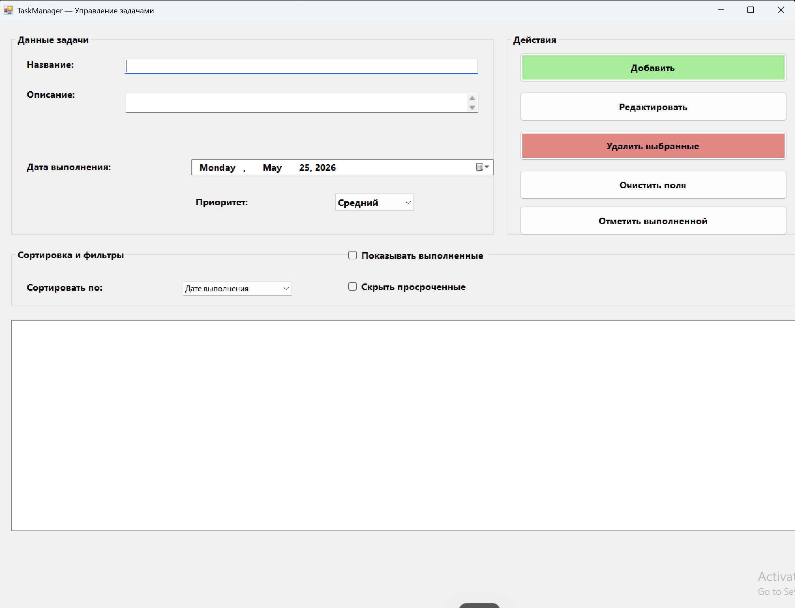

# TaskManager — Управление задачами

# Описание

Приложение для управления личными задачами с возможностью:
- Добавления, редактирования и удаления задач
- Сортировки по дате, приоритету и названию
- Фильтрации выполненных и просроченных задач
- Цветовой индикации просроченных задач (красным цветом)
- Множественного выбора и удаления задач

# Требования к системе

- Операционная система: Windows 7 и выше
- .NET Framework 
- Visual Studio 2022 (или новее)

# Инструкция по запуску

1. Откройте файл `TaskManager.sln` в Visual Studio
2. Нажмите **F5** или кнопку **Start** для запуска проекта
3. Приложение запустится и будет готово к работе

# Авторы

Студент: [Лушпин Руслан]  
Группа: [2ИСП-224-О]